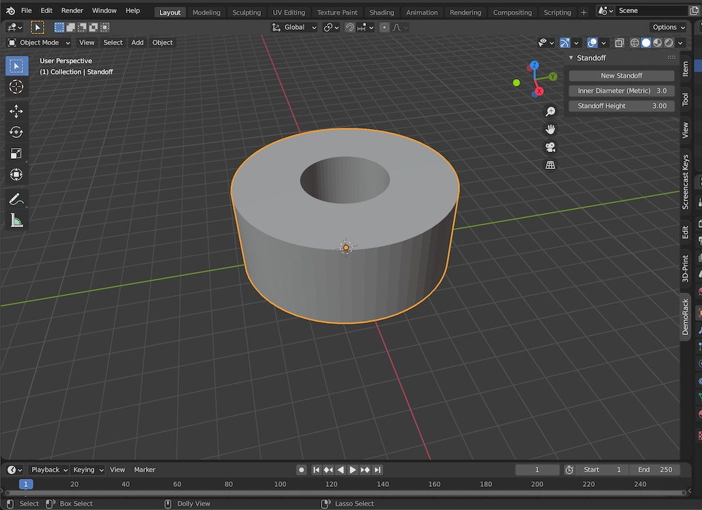

# DemoRack #
**[Blender](https://www.blender.org) Add-on for dynamically creating 3D Printable Mini-Rack Components** 

> *How-to Series Rebuild Version* of [DynaRack](https://github.com/ocommaj/dynarack)

**Inspired by [6" Rack Enclosure, Customizable](https://www.thingiverse.com/thing:1936196) by [@KronBjorn](https://www.github.com/kronbjorn)**
> *Semi-reinventing the wheel: [@KronBjorn/SixInchRack](https://github.com/KronBjorn/SixInchRack) gives some configurability via .scad & app*

  <em>Status at End of Part 3</em>

## Medium Posts ##
**[Part 1](https://levelup.gitconnected.com/configure-blender-for-3d-printing-via-python-ecf729e4099b)** Launch Blender for 3D Printing via Python

**[Part 2](https://levelup.gitconnected.com/rapidly-spawn-printable-meshes-via-blender-python-9ff5c3af6379)** Rapidly Spawn Meshes in Blender via Scripting
